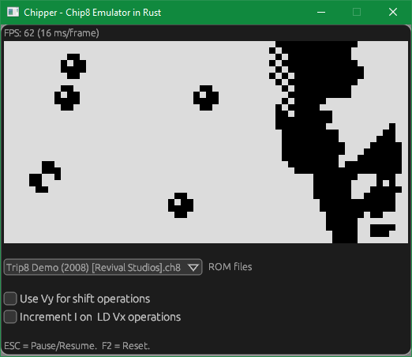

# About
Chipper is a Chip-8 emulator written in Rust. It emulates all of the instructions, including some ambiguous ones. There are various sources that document the Chip-8 specifications and the instructions. Some resources that I found useful:

    * [Cowgod's Chip-8 Technical Reference](http://devernay.free.fr/hacks/chip8/C8TECH10.HTM)
    * [Chip-8 Tutorial](https://www.chip-8.com/tutorial)
    * [Massung's info on Chip-8](https://github.com/massung/chip-8)

The emulator is a port of the original [C++ emulator](https://github.com/ArjunNair/chip8) I wrote previously, with some noteable differences:

* It uses [egui](https://github.com/emilk/egui) for the GUI instead of Dear Imgui as in the C++ version.
* I didn't bother implementing sound in this version because it's a real pain for what is essentially a *very* boring beeper.
* It tries to maintain 60FPS in a lazy manner by calculating how much time it took to render one frame, and sleeping a bit if it's under 16ms (which is roughly but not quite 60Hz). The original C++ version actually syncs framerate to the sound which plays at 60Hz and is a lot more timing accurate.
* In order to get Egui to work with SDL2/OpenGL, I had to write an [Egui backend](https://crates.io/crates/egui_sdl2_gl) first. It's overkill for a project of this scope, but it might be useful for someone looking to do something similar with Egui and SDL2.

# Building and running the emulator
Provided you have the [Rust toolchain](https://www.rust-lang.org/) set up on your platform, this is as simple as downloading or cloning the repository and doing a:

 `cargo run --release`

# Releases
If you just want to run the executable, head to the Releases page and download the relevant binaries. I provide the Mac and Windows binaries only at the moment. Linux users, being the hardcore chaps that they are, can build and run the emulator on their favorite distro.